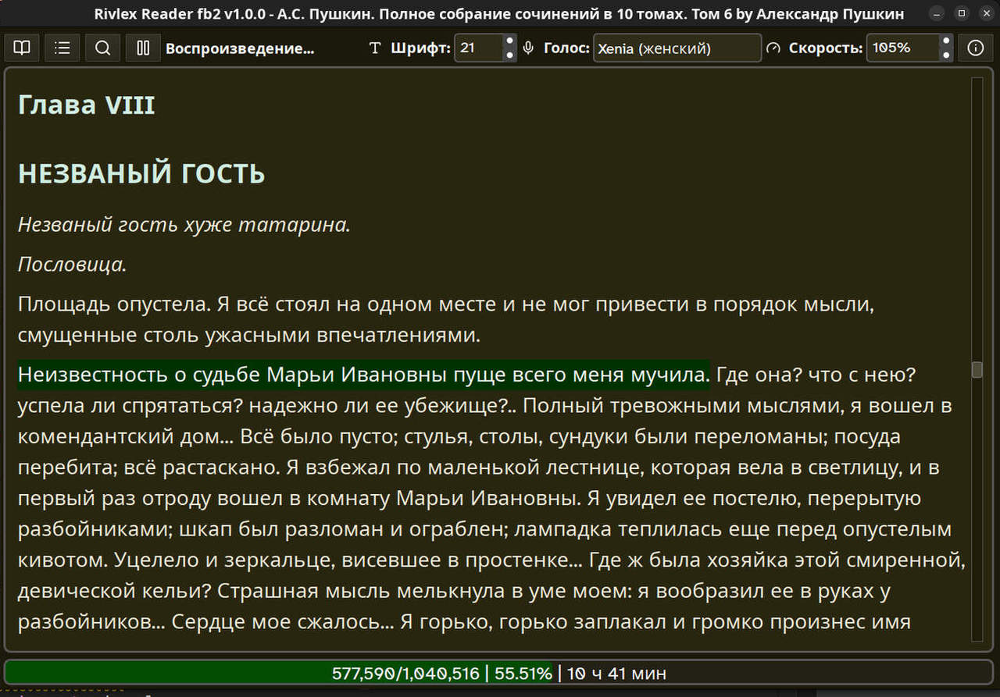
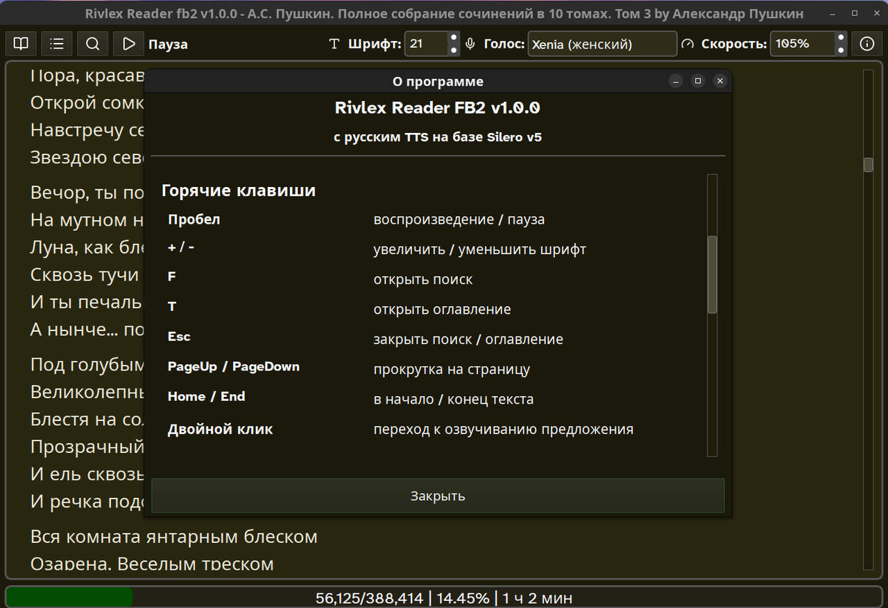
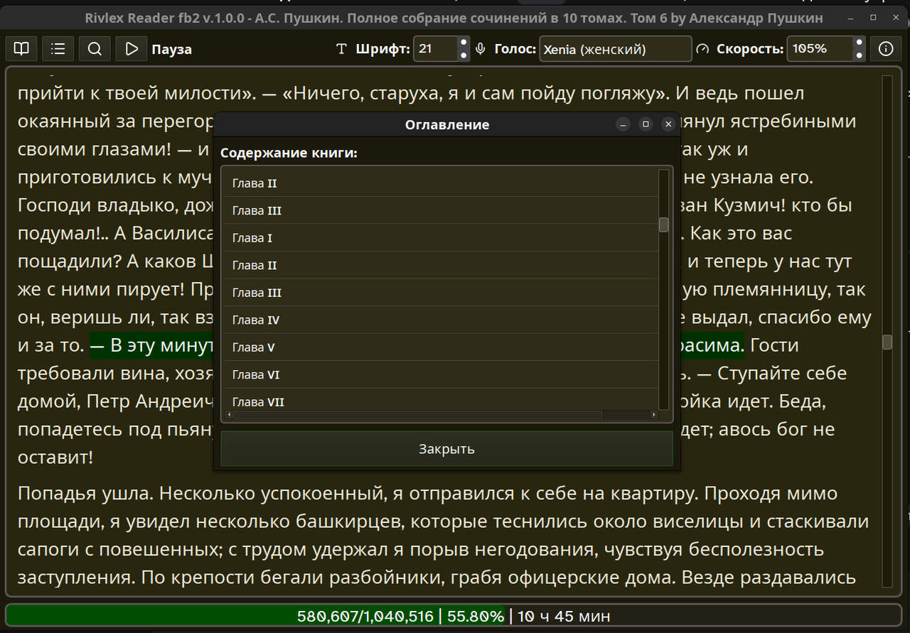
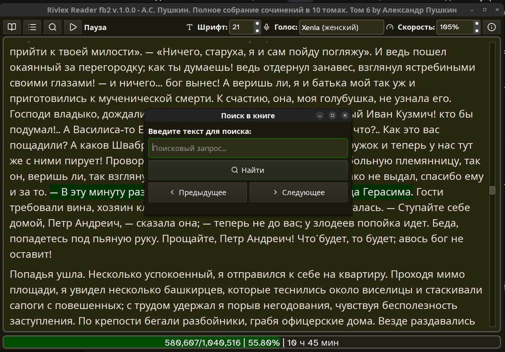

# Rivlex Reader FB2 с русским TTS


Десктопное приложение для чтения электронных книг в формате FB2 со встроенным синтезом русской речи.

### 📺 Видеодемонстрация

[<video src="docs/video.mp4" width="100%" controls></video>](https://github.com/user-attachments/assets/46cee3ea-d4eb-48cb-9027-cd8614bffb94)

## Основной функционал

- **Чтение FB2 книг** с сохранением форматирования (курсив, жирный шрифт)
- **Интерактивное оглавление** с быстрой навигацией по главам
- **Озвучивание текста** с использованием нейросети Silero TTS v5
- **Выбор голоса**: Aidar (мужской), Baya, Kseniya, Xenia (женские), Eugene (мужской)
- **Регулировка скорости чтения** от 80% до 140%
- **Настраиваемый размер шрифта** (12-48 pt)
- **Специальный шрифт** Atkinson Hyperlegible Next для людей с нарушениями зрения
- **Полнотекстовый поиск** с навигацией по результатам
- **Автосохранение позиции** чтения при закрытии книги
- **Поддержка кириллических кодировок**: автоматическое определение UTF-8, Windows-1251, KOI8-R
- **Переход к предложению** двойным кликом

## Интерфейс приложения

<p align="center">
  
  
</p>
<p align="center">
  
  
</p>

## Горячие клавиши

### Управление
- **F** - открыть поиск
- **T** - открыть оглавление
- **Пробел** - воспроизведение / пауза
- **+** / **-** - увеличить / уменьшить шрифт
- **Esc** - закрыть окно поиска или оглавления

### Навигация по тексту
- **PageUp** / **PageDown** - прокрутка на страницу вверх/вниз
- **Home** / **End** - переход в начало/конец текста
- **↑** / **↓** - плавная прокрутка текста
- **Двойной клик** - переход к озвучиванию выбранного предложения
- **Двойной клик по главе** (в оглавлении) - переход к выбранной главе

## Используемые библиотеки

| Библиотека | Версия | Лицензия | Назначение |
|-----------|--------|----------|------------|
| **Python** | 3.11+ | PSF License | Язык программирования |
| **PySide6** | 6.6+ | LGPL v3 | GUI фреймворк (Qt для Python) |
| **PyTorch** | 2.x | BSD-3-Clause | Движок нейросети (CPU-версия) |
| **Silero TTS** | v5 | CC BY-NC-SA 4.0 | Русская нейросеть синтеза речи |
| **lxml** | 5.x | BSD-3-Clause | Парсинг XML/FB2 файлов |
| **chardet** | 5.x | LGPL v2.1 | Автоопределение кодировки текста |
| **num2words** | 0.5.x | LGPL v3 | Преобразование чисел в слова |
| **scipy** | 1.10+ | BSD-3-Clause | Обработка звукового сигнала |
| **numpy** | 1.24+ | BSD-3-Clause | Работа с массивами аудио |
| **Atkinson Hyperlegible Next** | - | SIL OFL 1.1 | Шрифт для улучшенной читаемости |
| **Lucide Icons** | 0.563.0 | MIT | SVG иконки интерфейса |

## Системные требования

- **ОС**: Windows 10+, macOS 10.14+ или Linux (Ubuntu/Debian)
- **Python**: 3.11 или выше
- **RAM**: минимум 2 ГБ
- **Аудио-плеер**: ffplay, aplay, paplay, play или mpv

## Установка

### Linux (Ubuntu/Debian)

```bash
# Установка необходимых системных библиотек (нужны для обработки звука)
sudo apt update && sudo apt install ffmpeg -y

# Клонирование и переход в папку
git clone https://github.com/OtlichnoBy/rivlex-reader.git
cd rivlex-reader

# Создание и активация окружения (самый безопасный метод)
python3 -m venv venv
source venv/bin/activate

# Установка зависимостей одной командой
pip install --upgrade pip
pip install -r requirements.txt
```

**Для пользователей Anaconda/Miniconda:**
```bash
# Создание conda-окружения
conda create -n rivlex_reader python=3.11 -y
conda activate rivlex_reader

# Установка зависимостей
pip install -r requirements.txt
```

### Windows

```bash
# 1. Установите Python 3.11+ с python.org
# 2. Установите ffmpeg:
#    - Скачайте с https://github.com/BtbN/FFmpeg-Builds/releases
#    - Или используйте winget: winget install ffmpeg

# 3. В PowerShell или CMD:
git clone https://github.com/OtlichnoBy/rivlex-reader.git
cd rivlex-reader

python -m venv venv
venv\Scripts\activate

pip install --upgrade pip
pip install -r requirements.txt
```

### macOS

```bash
# 1. Установите ffmpeg (необходим для обработки звука)
# Если нет Homebrew, установите с https://brew.sh/
brew install ffmpeg

# 2. Клонирование репозитория
git clone https://github.com/OtlichnoBy/rivlex-reader.git
cd rivlex-reader

# 3. Создание виртуального окружения
python3 -m venv venv
source venv/bin/activate

# 4. Установка зависимостей
pip install --upgrade pip
pip install -r requirements.txt
```

## Запуск

```bash
# Linux
source venv/bin/activate
python reader.py

# Windows
venv\Scripts\activate
python reader.py
```

## Особенности реализации

### Качество звука
- **Fade-out**: плавное затухание 10 мс в конце каждого фрагмента для устранения щелчков
- **Оптимизированный плеер**: приоритет ffplay для лучшей буферизации
- **Разбиение текста**: фрагменты до 1200 символов для баланса между качеством и задержками

### Производительность
- **CPU-only PyTorch**: работает на любом процессоре без GPU
- **Отключен gc.collect()**: минимизация фризов во время воспроизведения
- **Потоковая генерация**: синтез и воспроизведение в отдельном потоке

### UI/UX
- **Темная тема**: зеленые акценты на темно-коричневом фоне
- **SVG-иконки**: масштабируемые белые иконки Lucide
- **Адаптивный шрифт**: Atkinson Hyperlegible Next с fallback на Arial

## Лицензия

**Важно:** Этот проект использует модели Silero TTS, которые распространяются под лицензией **CC BY-NC-SA 4.0** (Creative Commons Attribution-NonCommercial-ShareAlike 4.0 International).

### Что это означает:

- ✅ **Можно**: использовать для личных некоммерческих целей, изучения, исследований
- ✅ **Можно**: модифицировать и распространять с указанием авторства
- ❌ **Нельзя**: использовать в коммерческих целях (продавать, встраивать в платные продукты)
- ⚠️ **Обязательно**: производные работы должны распространяться под той же лицензией

### Компоненты проекта:

- **Модели Silero TTS**: CC BY-NC-SA 4.0 (некоммерческая)
- **Проект**: подпадает под CC BY-NC-SA 4.0 из-за зависимости от моделей

**Ссылки на лицензии:**

- Silero Models: [LICENSE](https://github.com/snakers4/silero-models/blob/master/LICENSE)
- PySide6 (Qt for Python): [LGPL v3](https://www.gnu.org/licenses/lgpl-3.0.html)
- PyTorch: [BSD-3-Clause](https://github.com/pytorch/pytorch/blob/master/LICENSE)
- lxml: [License / lxml](https://lxml.de/LICENSE.html)
- chardet: [License](https://github.com/chardet/chardet/blob/master/LICENSE)
- num2words: [License](https://github.com/savoirfairelinux/num2words/blob/master/LICENSE)
- scipy: [License](https://github.com/scipy/scipy/blob/main/LICENSE.txt)
- numpy: [License](https://numpy.org/license.html)
- Atkinson Hyperlegible Next (font): [SIL OFL 1.1](https://scripts.sil.org/cms/scripts/page.php?site_id=nrsi&id=OFL)
- Lucide Icons: [MIT](https://github.com/lucide-icons/lucide/blob/main/LICENSE)

## Благодарности

- Команде [Silero Models](https://github.com/snakers4/silero-models) за отличную русскую TTS
- Проекту [Atkinson Hyperlegible](https://brailleinstitute.org/freefont) за доступный шрифт
- [Lucide Icons](https://lucide.dev/) за красивые SVG иконки
